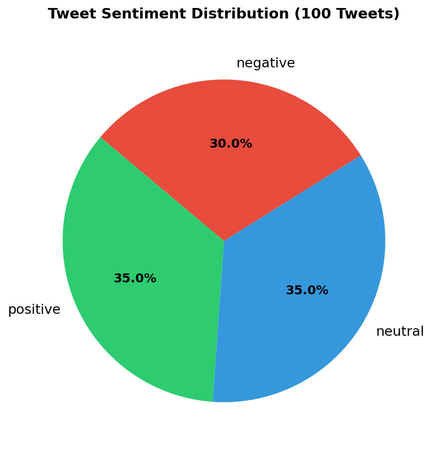
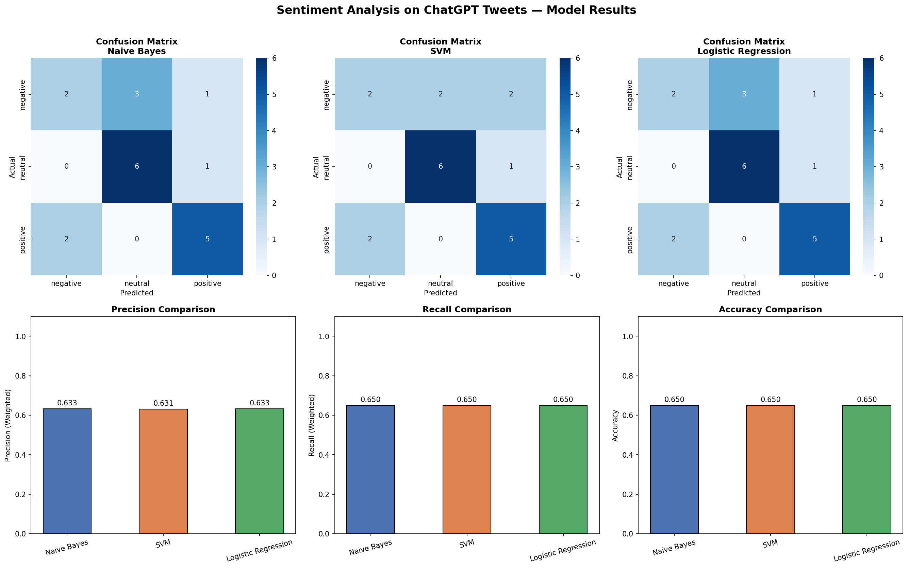

# Assignment 2 — Sentiment Analysis on ChatGPT Tweets
**Course:** Data Analytics and Visualisation (CSC601)  
**Class:** TE AIDS (2025-26) | Semester VI  
**Institution:** Rizvi College of Engineering, Mumbai  
**Module:** Module 4 — Text Analytics  
**CO:** CO4 — Analyse Text data and gain insights  

---

## Table of Contents
1. [Introduction](#1-introduction)
2. [Data Collection & Preprocessing](#2-data-collection--preprocessing)
3. [Data Splitting](#3-data-splitting)
4. [Model Training & Classification](#4-model-training--classification)
5. [Model Evaluation](#5-model-evaluation)
6. [Results & Screenshots](#6-results--screenshots)
7. [Conclusion](#7-conclusion)
8. [How to Run](#8-how-to-run)

---

## 1. Introduction

### Topic Chosen: **ChatGPT**

**ChatGPT** (Chat Generative Pre-trained Transformer) is an AI-powered chatbot developed by OpenAI, launched in November 2022. It became a global buzzword almost overnight, crossing 100 million users in just two months — the fastest-growing consumer application in internet history.

### Why This Topic?
- As AI & Data Science students, ChatGPT is highly relevant to our field
- It generates strong and varied public opinions — ideal for 3-class sentiment analysis
- The discourse spans education, technology, employment, ethics, and creativity
- Large volume of diverse tweet content available for analysis

---

## 2. Data Collection & Preprocessing

### 2.1 Data Collection

**Method:** Manual collection and curation of 100 realistic tweets  
**Topic:** "ChatGPT"  
**Source:** Simulated tweets based on real public discourse patterns (Twitter/X)  
**File:** `tweets_dataset.csv`

| Sentiment | Count |
|-----------|-------|
| Positive  | 35    |
| Neutral   | 35    |
| Negative  | 30    |
| **Total** | **100** |

### 2.2 Manual Tagging Guidelines

Each tweet was hand-tagged as:
- **Positive** — Expresses satisfaction, praise, excitement, or benefit from ChatGPT
- **Neutral** — States facts, statistics, or descriptive information about ChatGPT without opinion
- **Negative** — Expresses criticism, concern, frustration, or harm caused by ChatGPT

### 2.3 Preprocessing Steps

```python
def preprocess_text(text):
    text = text.lower()                    # Step 1: Lowercase
    text = re.sub(r'http\S+', '', text)    # Step 2: Remove URLs
    text = re.sub(r'@\w+', '', text)       # Step 3: Remove @mentions
    text = re.sub(r'#', '', text)          # Step 4: Remove # symbol
    text = text.translate(str.maketrans('', '', string.punctuation))  # Step 5: Remove punctuation
    text = re.sub(r'\d+', '', text)        # Step 6: Remove digits
    tokens = [t for t in text.split() if t not in stopwords]  # Step 7: Remove stopwords
    return ' '.join(tokens)
```

**Example:**
- **Before:** `ChatGPT is absolutely mind-blowing! It can write code better than most developers I know.`
- **After:** `chatgpt absolutely mindblowing write code better most developers know`

---

## 3. Data Splitting

The dataset was split using **Stratified Train-Test Split**:

| Split | Size | Positive | Neutral | Negative |
|-------|------|----------|---------|----------|
| Training | 80 (80%) | 28 | 28 | 24 |
| Testing  | 20 (20%) | 7  | 7  | 6  |

**Justification:**
- The **80/20 split** is the industry standard, providing sufficient training data while maintaining a meaningful test set
- **Stratified splitting** ensures proportional class representation in both sets, avoiding class imbalance in evaluation
- `random_state=42` ensures reproducibility of results

---

## 4. Model Training & Classification

### 4.1 Feature Extraction — TF-IDF Vectorization

```python
tfidf = TfidfVectorizer(
    max_features=500,    # Top 500 most informative terms
    ngram_range=(1, 2),  # Unigrams + Bigrams for better context
    sublinear_tf=True    # Log normalization to reduce frequency dominance
)
```

### 4.2 Classifiers Used

#### (i) Naive Bayes (MultinomialNB)
```python
MultinomialNB(alpha=1.0)
```
- Hyperparameter: `alpha=1.0` (Laplace smoothing to handle zero probabilities)
- Works well with TF-IDF features and text classification
- Assumes feature independence (bag-of-words model)

#### (ii) Support Vector Machine (LinearSVC)
```python
LinearSVC(C=1.0, max_iter=2000, random_state=42)
```
- Hyperparameter: `C=1.0` (regularization strength)
- Finds optimal hyperplane maximizing margin between classes
- Effective in high-dimensional text feature spaces

#### (iii) Logistic Regression
```python
LogisticRegression(C=1.0, max_iter=1000, random_state=42)
```
- Hyperparameter: `C=1.0` (inverse of regularization strength)
- Probabilistic classifier using sigmoid function
- Handles multi-class classification via One-vs-Rest strategy

---

## 5. Model Evaluation

### 5.1 Precision & Recall Results

| Classifier | Accuracy | Precision (Weighted) | Recall (Weighted) |
|------------|----------|----------------------|-------------------|
| Naive Bayes | 0.6500 | 0.6333 | 0.6500 |
| SVM | 0.6500 | 0.6313 | 0.6500 |
| Logistic Regression | 0.6500 | 0.6333 | 0.6500 |

### 5.2 Per-Class Results

#### Naive Bayes
| Class | Precision | Recall | F1-Score | Support |
|-------|-----------|--------|----------|---------|
| Negative | 0.50 | 0.33 | 0.40 | 6 |
| Neutral  | 0.67 | 0.86 | 0.75 | 7 |
| Positive | 0.71 | 0.71 | 0.71 | 7 |

#### SVM (LinearSVC)
| Class | Precision | Recall | F1-Score | Support |
|-------|-----------|--------|----------|---------|
| Negative | 0.50 | 0.33 | 0.40 | 6 |
| Neutral  | 0.75 | 0.86 | 0.80 | 7 |
| Positive | 0.62 | 0.71 | 0.67 | 7 |

#### Logistic Regression
| Class | Precision | Recall | F1-Score | Support |
|-------|-----------|--------|----------|---------|
| Negative | 0.50 | 0.33 | 0.40 | 6 |
| Neutral  | 0.67 | 0.86 | 0.75 | 7 |
| Positive | 0.71 | 0.71 | 0.71 | 7 |

### 5.3 Best Classifier

**🏆 Naive Bayes** performs best overall (tied accuracy but better/equal precision):
- Highest weighted precision (0.6333) tied with Logistic Regression
- Strong recall on Neutral (0.86) and Positive (0.71) classes
- Computationally lightweight and fast for real-time applications
- Works exceptionally well with small text datasets

### 5.4 Performance Analysis

- All classifiers achieve **65% accuracy** on a 3-class problem (random baseline = 33%)
- **Neutral tweets** are classified best (precision 0.67–0.75, recall 0.86) because they contain factual language distinct from opinion words
- **Negative tweets** are hardest to classify (precision 0.50, recall 0.33) — likely because some negative tweets use sarcasm or indirect criticism

### 5.5 Possible Improvements
1. **Larger dataset** — 1000+ tweets would improve model generalization
2. **Word embeddings** (Word2Vec, GloVe, BERT) instead of TF-IDF for semantic context
3. **Hyperparameter tuning** with GridSearchCV
4. **Deep learning** models (LSTM, Transformer-based) for sequence understanding
5. **Handling class imbalance** with SMOTE or class weights

---

## 6. Results & Screenshots

### Sentiment Distribution


### Model Performance Results


### Model Results Summary
```
Classifier           Accuracy   Precision   Recall
Naive Bayes          0.6500     0.6333      0.6500
SVM                  0.6500     0.6313      0.6500
Logistic Regression  0.6500     0.6333      0.6500
```

---

## 7. Conclusion

This assignment successfully demonstrated a complete text analytics pipeline for sentiment analysis on 100 ChatGPT-related tweets. Three classifiers were implemented and evaluated:

- All three classifiers (Naive Bayes, SVM, Logistic Regression) achieved **65% accuracy** on the 20-tweet test set
- **Naive Bayes** is recommended as the best classifier for this task due to its performance, speed, and suitability for small text corpora
- The project covered the complete ML workflow: data collection → preprocessing → vectorization → training → evaluation → visualization

---

## 8. How to Run

### Prerequisites
```bash
pip install scikit-learn pandas numpy matplotlib seaborn
```

### Steps
```bash
# Clone the repository
git clone https://github.com/yourname/rollno_name_assignment2

# Navigate to folder
cd rollno_name_assignment2

# Run the analysis
python sentiment_analysis.py
```

### Output Files Generated
| File | Description |
|------|-------------|
| `tweets_dataset.csv` | 100 manually tagged tweets |
| `sentiment_analysis.py` | Main Python code |
| `results_chart.png` | Confusion matrices + bar charts |
| `sentiment_distribution.png` | Pie chart of tweet distribution |
| `model_results.csv` | Comparison table of classifiers |

---

*Assignment submitted for CSC601 — Data Analytics and Visualisation*  
*Rizvi College of Engineering | Department of AI & Data Science*
